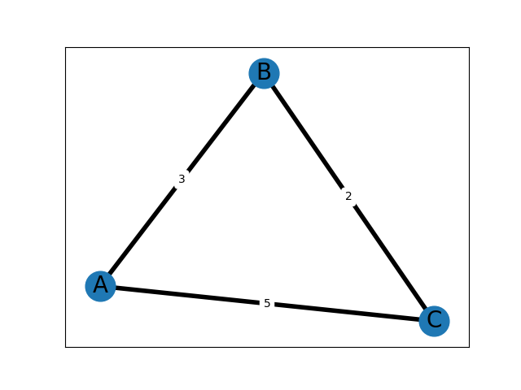
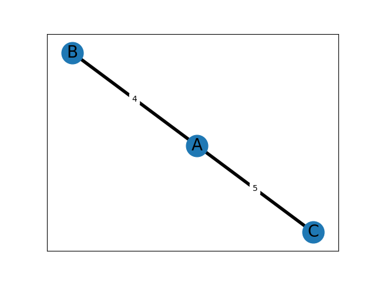

# Network Routing TUI

<!--

A terminal user interface (TUI) application for simulating and visualizing network routing algorithms. Built with Python, Textual, and Matplotlib.

## Usage

```
uv init --lib --name network_routing_tui --python=3.12
uv sync
uv lock
uv run nrt 
uv run python tests/test.py
```
-->

This project implements adaptive network routing algorithms for CS513 Computer Networks, providing both a Text User Interface (TUI) and a command-line interface (CLI). The application simulates a dynamic network where nodes are single-character labels and links have integer costs. You can build graphs, modify them, run routing algorithms, visualize results, and inspect routing tables.

---

## Features

### Graph Management

* Add or update an edge with a cost
* Remove edges (and automatically remove orphaned nodes)
* Load graphs from text files
* Save graphs to file
* Clear the current graph

### Routing Algorithms

* **Link-State (LS)**
  * Compute shortest paths from a chosen node
  * Display routing tables with destination, next-hop, and cost
* **Distance-Vector (DV)**
  * Perform one global DV iteration per command
  * Routing tables evolve over successive iterations

### Interfaces

* **CLI mode** for scripted or manual interaction
* **Full TUI mode** with:
  * Live graph visualization
  * Node tabs showing routing tables
  * Buttons for Load, Save, Clear, Show
  * Command input box
  * Popup dialogs for filenames
  * Notifications for errors and warnings

---

## Repository Structure

```
.
├── src
│   └── network_routing_tui
│       ├── cli.py                # CLI interface
│       ├── error.py              # Warning helper
│       ├── graph.py              # Graph logic + drawing
│       ├── __init__.py
│       ├── layout.css            # TUI styling
│       ├── link_state.py         # Link-State algorithm
│       ├── __main__.py           # Entry point (tui/cli)
│       ├── network_routing.py    # Command parsing + core logic
│       ├── routing_table.py      # Routing table objects
│       └── tui.py                # Full Textual-based TUI
├── README.md
├── pyproject.toml
└── uv.lock
```

---

## TUI Overview

Launching the TUI presents the following interface:


* **Graph Visualization**: Live graph visualization. It shows the current network topology as a graph, rendered to the TUI.
* **List of Routing Tables**: Routing table for each of the nodes in the network. Displays destination, next-hop, and cost.
* **Command Input**: Input box for commands (see Basic Commands above).
* **Buttons**: Buttons for common actions:
  * **Load**: Load a graph from a file.
  * **Save**: Save the current graph to a file.
  * **Clear**: Clear the current graph.
  * **Show**: Open a window with the current graph visualization.

---

## How to Run

The application can be run in either TUI or CLI mode.

<!--  TODO run with `uv` or just python -->

### Run the TUI (default)

The TUI mode provides a full textual interface in the terminal with live graph visualization. This mode is useful for interactive exploration.

```bash
python -m network_routing_tui --tui
```

### Run the CLI

The CLI mode provides a simple command-line interface for manual interaction.

```bash
python -m network_routing_tui --cli
```

### Run the CLI with a script file

Provide a text file with commands to execute sequentially. This mode is useful for testing and running reproducible experiments.

```bash
python -m network_routing_tui --cli --script commands.txt
```

---

## Logging

You can set the log level for warnings and errors using the `--log-level` argument. Available levels are `ERROR`, `WARNING`, and `NONE`. The default is `WARNING`.

---

## Basic Commands

The following commands are available in both TUI and CLI modes:

```
X Y COST          Add or update edge X-Y with given COST
X Y -             Remove edge between nodes X and Y
ls X              Run link-state from node X
dv X              Run one distance-vector iteration; print X's table
show              Display the graph in a window
saveg FILE        Save graph to FILE
savert X FILE     Save routing table of node X to FILE
print X           Print routing table for node X
load FILE         Load graph from FILE
clear             Remove all nodes and edges
help              Show help
quit              Exit
exit              Exit
```

---

## Usage

> For the purpose of explaining usage, the commands will be shown in CLI mode, but they work identically in TUI mode.

> Code snippets for the CLI are prefixed with `>`, while bash commands are not.

### 1. Build a graph

One can build the initial graph by loading from a file or adding edges manually.

* **Load from file**:

The input file should have one edge per line in the format `X Y COST`.

```bash
cat test_graph.txt
A D 5
D F 2
A B 2
A E 6
D E 4
E F 1
F G 7
B C 1
C E 3
C H 1
G H 3
```

To load from the CLI.

```
> load test_graph.txt
> show         # open graph visualization window
```


* **Add edges manually**:

```
> clear        # start fresh
> A B 3
> B C 2
> A C 5
> show
```



### 2. Modify the graph

Edges can be updated or removed:

```
> A B 4        # Update cost of edge A-B to 4
> B C -        # Remove edge B-C
> show
```



### 3. Save the graph

The current graph can be saved to a file:

```
> saveg my_graph.txt
```

The graph is saved in the same format as the input files.

```bash
cat my_graph.txt
A B 4
A C 5
```

### 4. Run routing algorithms

You can run Link-State or Distance-Vector algorithms from any node.

* Link-State from node A:

Runs the Link-State algorithm from node A and prints the routing table. It only runs for the specified node, not all nodes.

```
> load test_graph.txt
> ls A         # run link-state from A and print routing table
A - 0
B - 2
C B 3
H B 4
D - 5
E - 6
G B 7
F D 7
> print D      # print routing table for node D
D - 0 
```

* Distance-Vector from node A:

Runs one iteration of the Distance-Vector algorithm, updating routing tables for all nodes.

```
> clear
> load test_graph.txt
> dv A
A - 0
B - 2
D - 5
E - 6
> print D
D - 0
F - 2
E - 4
A - 5
```

### 5. Save routing tables

The routing table of any node can be saved to a file:

```
> ls A
> savert A rt_A.txt
```

```bash
cat rt_A.txt
A - 0
B - 2
C B 3
H B 4
D - 5
E - 6
G B 7
F D 7
```
